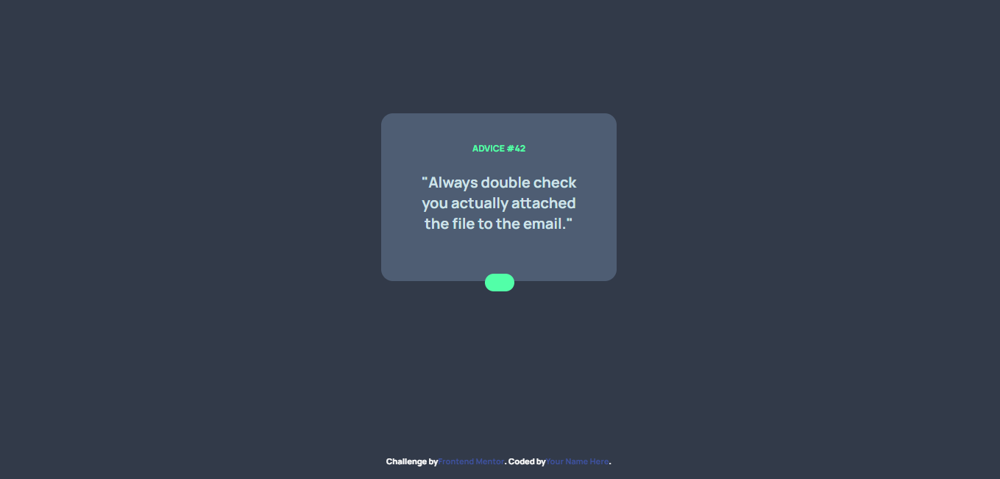
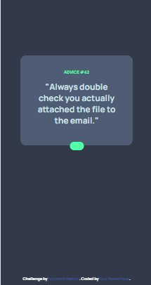

# Frontend Mentor - Advice generator app solution

This is a solution to the [Advice generator app challenge on Frontend Mentor](https://www.frontendmentor.io/challenges/advice-generator-app-QdUG-13db). Frontend Mentor challenges help you improve your coding skills by building realistic projects.

## Table of contents

- [Overview](#overview)
  - [The challenge](#the-challenge)
  - [Screenshot](#screenshot)
  - [Links](#links)
- [My process](#my-process)
  - [Built with](#built-with)
  - [What I learned](#what-i-learned)
  - [Continued development](#continued-development)
  - [Useful resources](#useful-resources)
- [Author](#author)
- [Acknowledgments](#acknowledgments)

**Note: Delete this note and update the table of contents based on what sections you keep.**

## Overview

### The challenge

Users should be able to:

- View the optimal layout for the app depending on their device's screen size
- See hover states for all interactive elements on the page
- Generate a new piece of advice by clicking the dice icon

### Screenshot





### Links

- Solution URL: [advice generator app](https://github.com/AkarExcel/advice-generator-app)
- Live Site URL: [Advice generator app](https://akarexcel.github.io/advice-generator-app/)

## My process
my process was as followed:
- I stared by creating the HTML structure according to how i planned the CSS would style
- Then i Added the style with TailwindCss using cdn
- I also downloaded some fonts from google to use for this project
- After Working on the UI using the mobile First work flow i added the Javascript that fetch the advice from the advice API

### Built with

- Semantic HTML5 markup
- CSS custom properties
- Flexbox
- CSS Grid
- Mobile-first workflow
- [Tailwindcss](https://tailwindcss.com/docs/) - CSS framework


**Note: These are just examples. Delete this note and replace the list above with your own choices**

### What I learned

Centering the Dice symbol was a slightly dificult i had to had my way through it using the absolute positioning and pushing the dice up it top property.

In the end it worked but i was hoping for a more elegant way of centering div

```html
<div class="dice-hover relative p-0 m-0">
        <div class="absolute rounded-full w-10 dice flex items-center p-3">
          
        </div>
      </div>
```
```css
* {
    margin: 0;
    padding: 0;
    font-family: 'Manrope', sans-serif;
    font-weight: 800;
    color: white;
}

body {
    background-color: #323a49;
}

.grayish-blue{
    background-color: #4e5d73;
}

.neon-green-color{
    color: hsl(150, 100%, 66%);
}

.light-cyan-color{
    color: hsl(193, 38%, 86%);
}

.dice {
    background-color: hsl(150, 100%, 66%);
    top: -10px;
    left: -1.2rem;
    
};

.dice-hover{
    position: relative;
}

.dice-hover:hover{
    box-shadow: 0px 0px 25px 15px hsl(150, 100%, 66%);
}

#advice {
    color: hsl(193, 38%, 86%);
}
#advice::before {
    content:'"';
    display: inline;
    width: 50px;
    height: 50px;
}
#advice::after {
    content:'"';
    display: inline;
    width: 50px;
    height: 50px;
}
```
```js
    async function main() {
      fetch('https://api.adviceslip.com/advice').then(function (response) {
      // The API call was successful!
      return response.json();
    }).then(function (data) {
      // This is the JSON from our response
      const adviceId = document.getElementById("adviceId");
      const advice = document.getElementById("advice");
      adviceId.innerHTML = data.slip.id
      advice.innerHTML = data.slip.advice

    }).catch(function (err) {
      // There was an error
      console.warn('Something went wrong.', err);
    });
    }

    main().catch(error => {
      console.error(error)
    })

```


**Note: Delete this note and the content within this section and replace with your own learnings.**

### Continued development

I will be focusing on using plain CSS for my future project to increase my understanding of the concept and build long term memory on the key property.

**Note: Delete this note and the content within this section and replace with your own plans for continued development.**


## Author

- Website - [Akar Excel](https://akarexcel.com.ng/)
- Frontend Mentor - [@AkarExcel](https://www.frontendmentor.io/profile/AkarExcel)
- Twitter - [@_akar_excel](https://www.twitter.com/_akar_excel)


## Acknowledgments

This is to thank Etido for reintroducing me to Frontend Mentor it is a really great website, and i am learn alot by practicing


